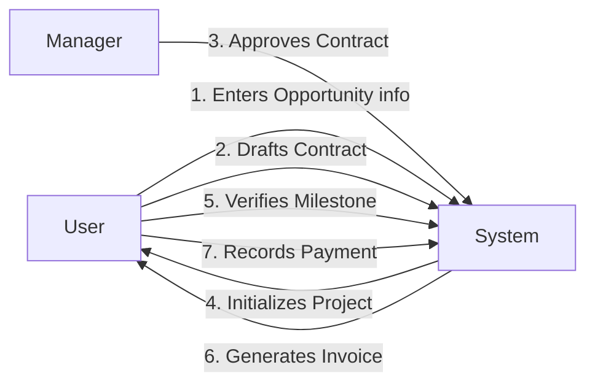
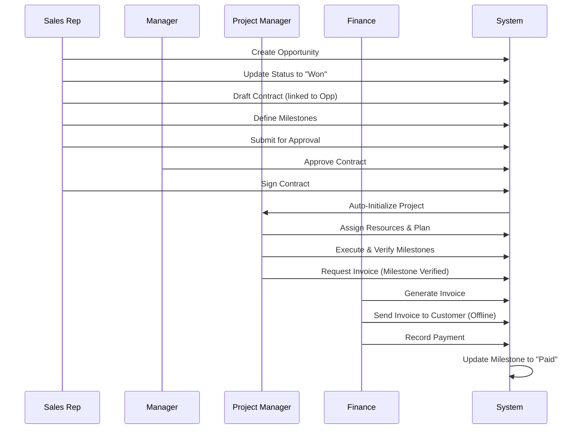

# Data Flow Diagrams (DFD)

## Level 0: Context Diagram

## Level 1: Lead-to-Cash Flow

## Data States

### Contract Status Flow
`Draft` -> `PendingApproval` -> `Approved` -> `Signed`

### Milestone Status Flow
`Pending` -> `Verified` -> `Ready_to_Invoice` -> `Invoiced` -> `Paid`

### Invoice Status Flow
`Draft` -> `Issued` -> `PartiallyPaid` -> `Paid`
