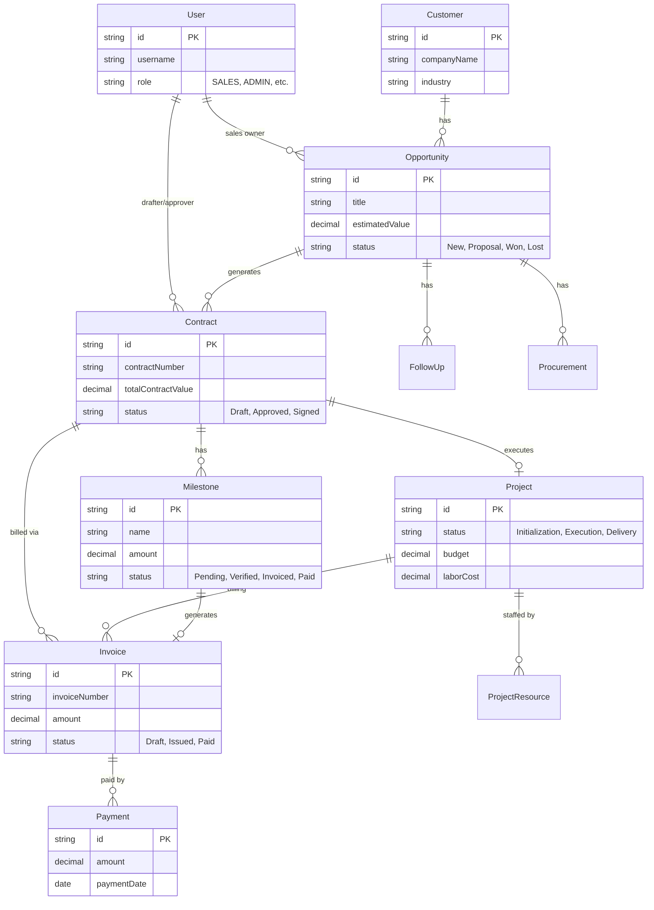

# Database Design

## 1. Entity-Relationship Diagram (ERD)

## 2. Table Configurations

### Core Business Entities
- **Customer**: Stores client information.
- **Opportunity**: Sales opportunities with stages, value, and probability.
- **Contract**: Legal agreements linked to opportunities. Includes status workflow (Draft -> Approved -> Signed).
- **Project**: Execution phase after contract signing. Tracks budget, costs, and resources.

### Financial Entities
- **Milestone**: Payment milestones defined in the contract. Tracks statuses: `Pending` -> `Verified` -> `Ready_to_Invoice` -> `Invoiced` -> `Paid`.
- **Invoice**: Created from milestones or manually. Tracks tax, attachments (receipts), and payment status.
- **Payment**: Records actual incoming funds against invoices.

### Bidding & Procurement
- **Procurement**: Tracks bidding projects (Tenders).
- **BiddingTask**: Tasks assigned to team members for preparing bid documents.

### System
- **User**: System users with Roles (RBAC).
- **AuditLog**: Tracks critical actions (Create/Update/Delete).
