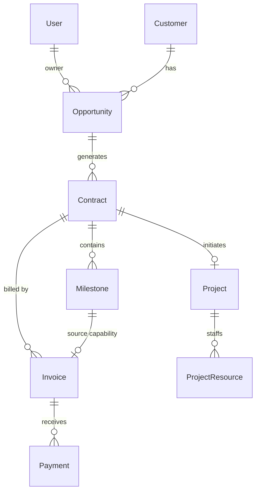

# Database Design Document

**System**: Lead-to-Cash System  
**Type**: Relational (PostgreSQL/SQLite)  
**ORM**: Prisma  
**Date**: 2026-01-02

---

## 1. Entity-Relationship Diagram (ERD)

---

## 2. Data Dictionary

Detailed table structure definitions.

### 2.1 Users
Base entity for system access and permissions.

| Field | Type | Required | Default | Description |
| :--- | :--- | :--- | :--- | :--- |
| id | String (UUID) | Yes | uuid() | Primary Key |
| username | String | Yes | - | Login name, Unique |
| password | String | Yes | - | Hashed Password |
| role | Enum | Yes | USER | Roles: ADMIN, MANAGER, SALES, USER |
| createdAt | DateTime | Yes | now() | Creation Timestamp |

### 2.2 Customers
The starting point of all business relationships.

| Field | Type | Required | Default | Description |
| :--- | :--- | :--- | :--- | :--- |
| id | String (UUID) | Yes | uuid() | Primary Key |
| companyName | String | Yes | - | Full Company Name |
| contactName | String | No | - | Primary Contact Person |
| email | String | No | - | Contact Email |
| taxId | String | No | - | Taxpayer ID (for deduplication) |

### 2.3 Opportunities
Sales funnel management.

| Field | Type | Required | Default | Description |
| :--- | :--- | :--- | :--- | :--- |
| id | String (UUID) | Yes | uuid() | Primary Key |
| title | String | Yes | - | Opportunity Title |
| customerId | String | Yes | - | FK -> Customer |
| status | Enum | Yes | New | Stages: New, Proposal, Negotiation, Won, Lost |
| estimatedValue | Decimal | Yes | 0 | Projected Deal Value |
| winProbability | Int | Yes | 0 | 0-100% |
| closeDate | DateTime | No | - | Expected Signing Date |
| ownerId | String | Yes | - | FK -> User (Sales Rep) |

### 2.4 Contracts
Core legal entity.

| Field | Type | Required | Default | Description |
| :--- | :--- | :--- | :--- | :--- |
| id | String (UUID) | Yes | uuid() | Primary Key |
| contractNumber | String | Yes | - | Unique ID (CON-xxx) |
| opportunityId | String | Yes | - | FK -> Opportunity |
| totalValue | Decimal | Yes | - | Final Contract Value |
| status | Enum | Yes | Draft | Draft, PendingApproval, Approved, Signed |
| startDate | DateTime | No | - | Effective Date |
| riskAssessment | String | No | - | Risk Notes |
| filePath | String | No | - | Scanned Document Path |

### 2.5 Milestones
Defines the payment schedule.

| Field | Type | Required | Default | Description |
| :--- | :--- | :--- | :--- | :--- |
| id | String (UUID) | Yes | uuid() | Primary Key |
| name | String | Yes | - | Milestone Name (e.g., Down Payment) |
| contractId | String | Yes | - | FK -> Contract |
| amount | Decimal | Yes | - | Amount for this phase |
| status | Enum | Yes | Pending | Pending, Verified, Ready_to_Invoice, Invoiced, Paid |
| invoiceDate | DateTime | No | - | Actual Invoice Date |

### 2.6 Projects
Delivery entity.

| Field | Type | Required | Default | Description |
| :--- | :--- | :--- | :--- | :--- |
| id | String (UUID) | Yes | uuid() | Primary Key |
| name | String | Yes | - | Project Name |
| contractId | String | No | - | FK -> Contract |
| status | Enum | Yes | Initialization| Initialization, Execution, Delivery, Closed |
| budget | Decimal | Yes | 0 | Project Budget |

### 2.7 Invoices
Financial entity.

| Field | Type | Required | Default | Description |
| :--- | :--- | :--- | :--- | :--- |
| id | String (UUID) | Yes | uuid() | Primary Key |
| invoiceNumber | String | Yes | - | Unique ID |
| contractId | String | Yes | - | FK -> Contract |
| milestoneId | String | No | - | FK -> Milestone (Optional) |
| amount | Decimal | Yes | - | Net Amount |
| taxAmount | Decimal | Yes | 0 | Tax Amount |
| totalAmount | Decimal | Yes | - | Gross Amount |
| status | Enum | Yes | Draft | Draft, Issued, Paid, Overdue |
| filePath | String | No | - | Electronic Invoice File |
| remarks | String | No | - | Comments |

### 2.8 Payments
Cash flow records.

| Field | Type | Required | Default | Description |
| :--- | :--- | :--- | :--- | :--- |
| id | String (UUID) | Yes | uuid() | Primary Key |
| paymentNumber | String | Yes | - | Transaction ID |
| invoiceId | String | Yes | - | FK -> Invoice |
| amount | Decimal | Yes | - | Received Amount |
| paymentDate | DateTime | Yes | - | Receipt Date |
| method | Enum | Yes | BankTransfer| BankTransfer, Check, Cash |

---

## 3. Indexing Strategy
-   `User(username)`: Unique.
-   `Customer(taxId)`: Unique.
-   `Contract(contractNumber)`: Unique.
-   Foreign Keys: Indexed for performance join operations.

---

*End of Database Design*
