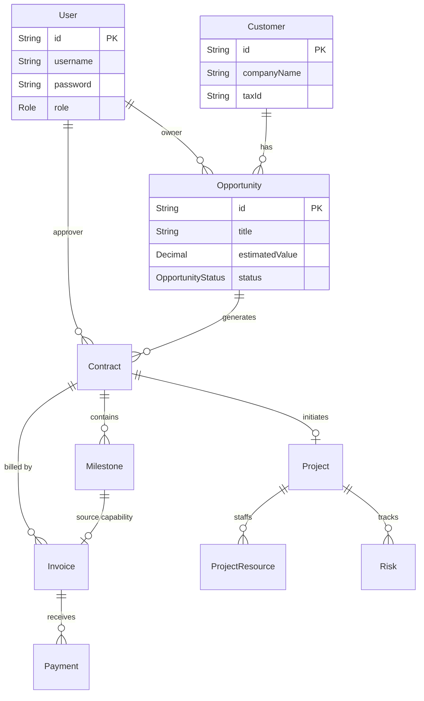

# 数据库设计文档 (Database Design)

**系统**: Lead-to-Cash System  
**数据库类型**: Relational (PostgreSQL/SQLite)  
**ORM**: Prisma  
**日期**: 2026-01-02

---

## 1. 实体关系图 (ER Diagram)

---

## 2. 数据字典 (Data Dictionary)

详细的表结构定义。

### 2.1 Users (用户表)
系统用户与权限管理基础。

| 字段名 | 类型 | 必填 | 默认值 | 描述 |
| :--- | :--- | :--- | :--- | :--- |
| id | String (UUID) | Yes | uuid() | 主键 |
| username | String | Yes | - | 登录用户名，唯一 |
| password | String | Yes | - | 加密后的密码 Hash |
| role | Enum | Yes | USER | 角色: ADMIN, MANAGER, SALES, USER |
| createdAt | DateTime | Yes | now() | 创建时间 |

### 2.2 Customers (客户表)
所有商业关系的起点。

| 字段名 | 类型 | 必填 | 默认值 | 描述 |
| :--- | :--- | :--- | :--- | :--- |
| id | String (UUID) | Yes | uuid() | 主键 |
| companyName | String | Yes | - | 公司全称 |
| contactName | String | No | - | 主要联系人 |
| email | String | No | - | 联系邮箱 |
| phone | String | No | - | 联系电话 |
| address | String | No | - | 办公地址 |
| taxId | String | No | - | 纳税人识别号 (用于查重) |

### 2.3 Opportunities (商机表)
销售漏斗管理。

| 字段名 | 类型 | 必填 | 默认值 | 描述 |
| :--- | :--- | :--- | :--- | :--- |
| id | String (UUID) | Yes | uuid() | 主键 |
| title | String | Yes | - | 商机标题 |
| customerId | String | Yes | - | 外键 -> Customer |
| status | Enum | Yes | New | 状态: New, Proposal, Negotiation, Won, Lost |
| estimatedValue | Decimal | Yes | 0 | 预计签约金额 |
| winProbability | Int | Yes | 0 | 赢单概率 (0-100) |
| closeDate | DateTime | No | - | 预计签约日期 |
| ownerId | String | Yes | - | 外键 -> User (销售负责人) |

### 2.4 Contracts (合同表)
核心法律实体。

| 字段名 | 类型 | 必填 | 默认值 | 描述 |
| :--- | :--- | :--- | :--- | :--- |
| id | String (UUID) | Yes | uuid() | 主键 |
| contractNumber | String | Yes | - | 合同编号 (Unique, CON-xxx) |
| opportunityId | String | Yes | - | 外键 -> Opportunity |
| totalValue | Decimal | Yes | - | 合同总金额 |
| status | Enum | Yes | Draft | 状态: Draft, PendingApproval, Approved, Rejected, Signed |
| startDate | DateTime | No | - | 生效日 |
| endDate | DateTime | No | - | 到期日 |
| riskAssessment | String | No | - | 风险评估备注 |
| filePath | String | No | - | 合同扫描件路径 |

### 2.5 Milestones (里程碑表)
定义分阶段收款计划。

| 字段名 | 类型 | 必填 | 默认值 | 描述 |
| :--- | :--- | :--- | :--- | :--- |
| id | String (UUID) | Yes | uuid() | 主键 |
| name | String | Yes | - | 里程碑名称 (如首付款) |
| contractId | String | Yes | - | 外键 -> Contract |
| amount | Decimal | Yes | - | 该阶段金额 |
| status | Enum | Yes | Pending | 状态: Pending, Verified, Ready_to_Invoice, Invoiced, Paid |
| dueDate | DateTime | No | - | 预计完成日期 |
| invoiceDate | DateTime | No | - | 实际开票日期 |
| paymentDate | DateTime | No | - | 实际收款日期 |

### 2.6 Projects (项目表)
交付管理实体。

| 字段名 | 类型 | 必填 | 默认值 | 描述 |
| :--- | :--- | :--- | :--- | :--- |
| id | String (UUID) | Yes | uuid() | 主键 |
| name | String | Yes | - | 项目名称 (通常同合同名) |
| contractId | String | No | - | 外键 -> Contract |
| status | Enum | Yes | Initialization| 状态: Initialization, Execution, Delivery, Closed |
| budget | Decimal | Yes | 0 | 项目预算 |

### 2.7 Invoices (发票表)
财务实体。

| 字段名 | 类型 | 必填 | 默认值 | 描述 |
| :--- | :--- | :--- | :--- | :--- |
| id | String (UUID) | Yes | uuid() | 主键 |
| invoiceNumber | String | Yes | - | 发票号 (Unique) |
| contractId | String | Yes | - | 外键 -> Contract |
| milestoneId | String | No | - | 外键 -> Milestone (可选) |
| amount | Decimal | Yes | - | 发票金额 (不含税) |
| taxAmount | Decimal | Yes | 0 | 税额 |
| totalAmount | Decimal | Yes | - | 价税合计 |
| status | Enum | Yes | Draft | 状态: Draft, Issued, PartiallyPaid, Paid, Cancelled, Overdue |
| filePath | String | No | - | 电子发票文件路径 |
| remarks | String | No | - | 财务备注 |

### 2.8 Payments (收款记录表)
资金流水。

| 字段名 | 类型 | 必填 | 默认值 | 描述 |
| :--- | :--- | :--- | :--- | :--- |
| id | String (UUID) | Yes | uuid() | 主键 |
| paymentNumber | String | Yes | - | 收款流水号 |
| invoiceId | String | Yes | - | 外键 -> Invoice |
| amount | Decimal | Yes | - | 收款金额 |
| paymentDate | DateTime | Yes | - | 到账日期 |
| method | Enum | Yes | BankTransfer| 方式: BankTransfer, Check, Cash, Other |

---

## 3. 索引优化 (Indexing)
-   `User(username)`: Unique index for login lookup.
-   `Customer(taxId)`: Unique index for deduplication.
-   `Contract(contractNumber)`: Unique index.
-   `Invoice(invoiceNumber)`: Unique index.
-   外键字段 (如 `customerId`, `ownerId`, `contractId`) 建议建立索引以优化关联查询性能。

---

*数据库设计文档结束*
